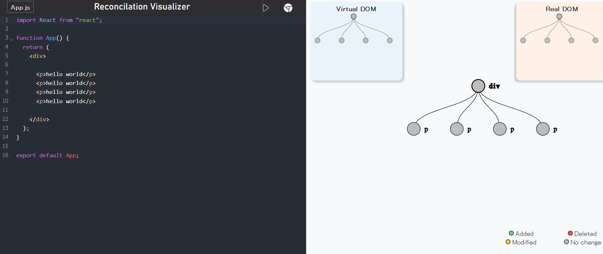
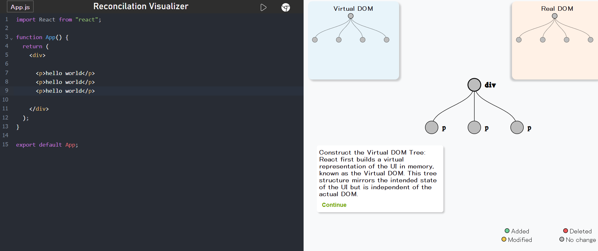
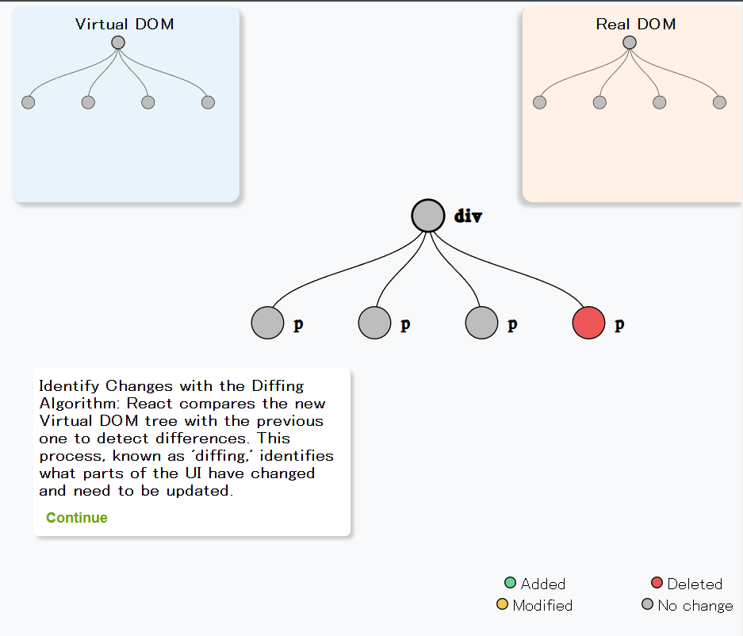
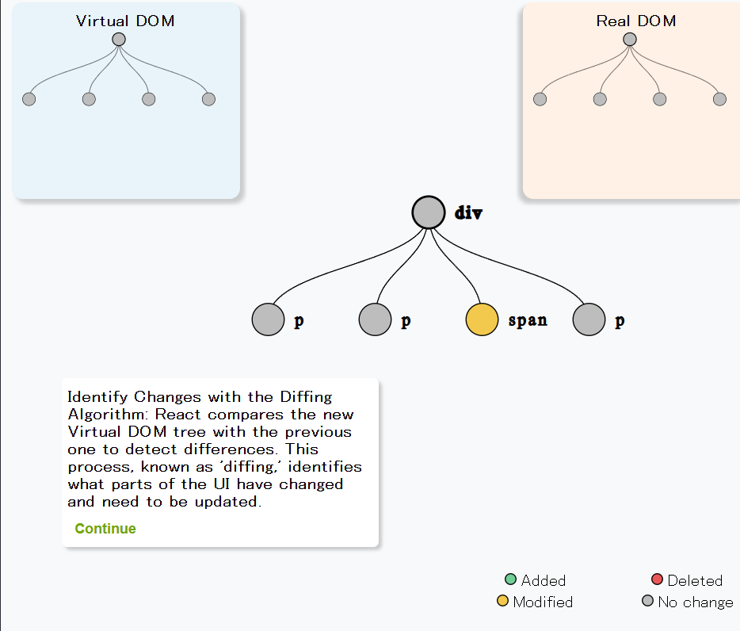

# REACT RECONCILATION VISUALIZER 

# Visit the Live Demo 🚀

[visit the live demo](https://deepaksingh74.github.io/reconcilation-visualizer/)

# Quick look Inside 👀

Home Screen

Updated Virtual DOM Tree

Tracks the Data of the node - added, modified, deleted and no change

## Contributing

If you’d like to contribute to this project, feel free to fork the repository, create a new branch, and submit a pull request. Contributions are welcome for bug fixes, feature requests, and improvements!

### Steps to Contribute

1. **Fork the repository.**
2. **Create a new branch**  
   `git checkout -b feature/your-feature`
3. **Make your changes.**
4. **Commit the changes**  
   `git commit -am 'Add your feature'`
5. **Push to the branch**  
   `git push origin feature/your-feature`
6. **Create a pull request.**

## License

This project is licensed under the MIT License - see the [LICENSE](LICENSE) file for details.

## Acknowledgments

- Thanks to the React team for building such an awesome framework.
- Inspired by React's internal reconciliation algorithm for educational purposes.

